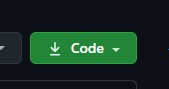
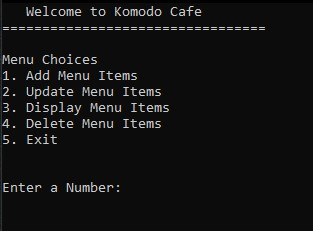
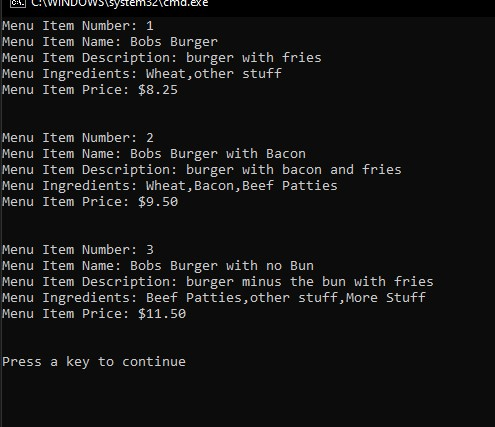

# Gold Badge Console Apps

Console Apps Added
1. Komodo Cafe
2. Komodo Claims Department
3. Komodo Insurance Badges
4. Komodo Company Outings
5. Komodo Insurance Email Problem


## Installation

1. Click the Green Code Button in this repository 
    - 
2. Choose from the following options:
   - Copy the Link and Use it to clone in Visual Studio 
   - Click the Open in Visual Studio Button
   - Click Download to download all files


## KomodoCafe
This was a challenge to make a Console app to be able to create, read, upodate and delete menu items.

Them Menu Class Includes:
- Meal Number
- Meal Name
- Description
- List of Ingredients
- Price

Main Menu in Console
- 

All Menu Items Displayed in Console
- 

```csharp

```
## Komodo Claims Department

```csharp

```

## Komodo Insurance Badges
```csharp

```

## Komodo Company Outings
```csharp

```
## Komodo Insurance Email Problem
```csharp

```

## Contributing
Pull requests are welcome.
