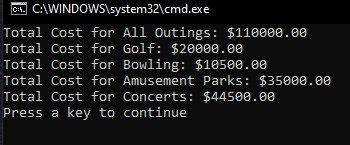

# Gold Badge Console Apps

Console Apps Added
1. Komodo Cafe
2. Komodo Claims Department
3. Komodo Insurance Badges
4. Komodo Company Outings
5. Komodo Insurance Email Problem


## Installation

1. Click the Green Code Button in this repository 
    - 
2. Choose from the following options:
   - Copy the Link and Use it to clone in Visual Studio 
   - Click the Open in Visual Studio Button
   - Click Download to download all files


## KomodoCafe
This was a challenge to make a Console app to be able to create, read, upodate and delete menu items.

Them Menu Class Includes:
- Meal Number
- Meal Name
- Description
- List of Ingredients
- Price

Main Menu for Cafe in Console


All Menu Items Displayed in Console


```csharp

```
## Komodo Claims Department

The Komodo Claims Challenge was to create an Insurance Console app to Create, Read, show the item to be removed from the queue.
It also removes or dequeues the items when the user enters 'y'. if they enter 'n' it will not be removed and go back to the menu.

Main Menu for Claims in Console


Claims Displayed in Console


## Komodo Insurance Badges
The Komodo Insurance Badges is a Console app that connects badges to doors. The user can add doors to a badge nuber, Update the badge to add or remove a door from the badge. 
The user can also Show all of the badges with the doors in which they have access.

Main Menu for Badges in Console


Badges Displayed in Console


## Komodo Company Outings
Komodo company outings console app takes financial information from the company outings and stores them in a list. This list is then able to be acced to be able to show the amount of money spent on different types of outings. It also shows the Total amount spent on Outings.

Main Menu for Badges in Console


Badges Displayed in Console




## Komodo Insurance Email Problem
Komodo Insurance wants to make a spam bot. They hired me to do it and I think I have a product they can use. It is not quite fully functional yet but it will get there. 

Main Menu for Badges in Console


Spam Email Addresses Displayed in Console


## Contributing
Pull requests are welcome.
